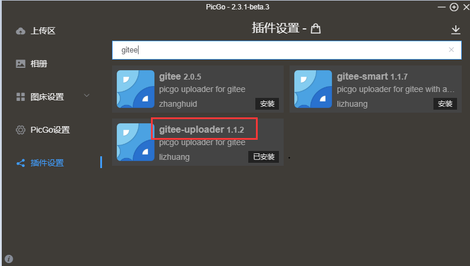
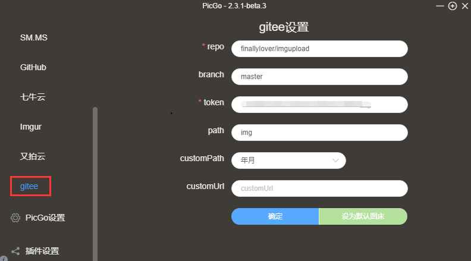
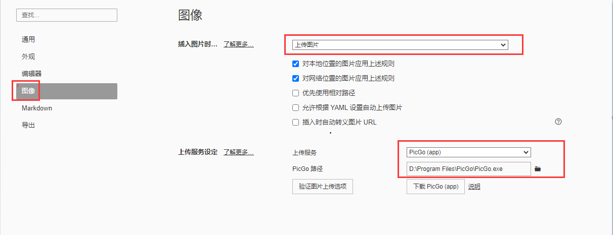
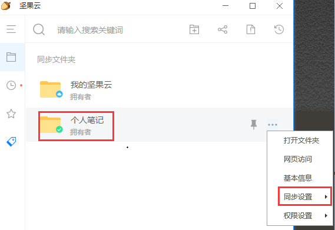

## docsfiy +github

### 下载

#### node

## Typora +PicGo +坚果云+gitee

### 软件下载

#### typora

#### PicGo 

#### 坚果云

### 配置

#### gitee配置

1. 注册gitee 账号

2. 新建仓库

   

3. 添加私人令牌

#### PicGo 配置

1. 安装gitee 插件

   

2. #### 参数配置

   

#### Typora配置

1. 添加PicGo 上传配置

   

#### 坚果云配置

1. 新建同步文件夹、设置同步

