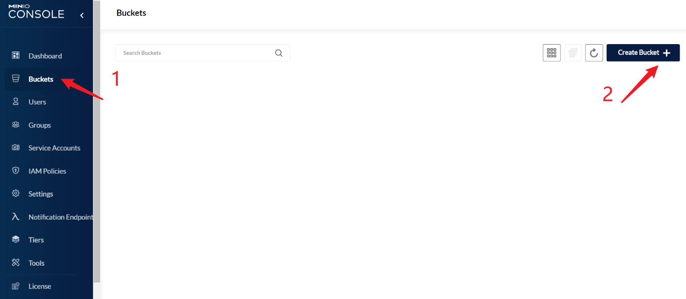
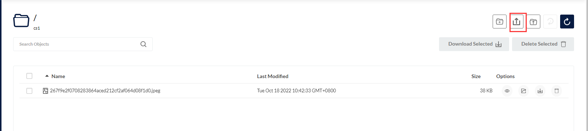

# minio 

## minoio 安装

```sell
#拉取
docker pull minio/minio:RELEASE.2022-01-03T18-22-58Z
#运行镜像
 docker run \
    -p 19000:9000 \
    -p 19001:9001 \
    --name carpxt-minio \
    -d --restart=always \
    -v /carpxt/data/minio/data:/data \
    -e "MINIO_ROOT_USER=carpxt" \
    -e "MINIO_ROOT_PASSWORD=carpxt123456" \
    minio/minio:RELEASE.2022-01-03T18-22-58Z server /data --console-address ":9001"
```

## 访问

http://localhost:19001

备注：密码在运行镜像的命令中有显示

## 使用

创建目录



上传图片

