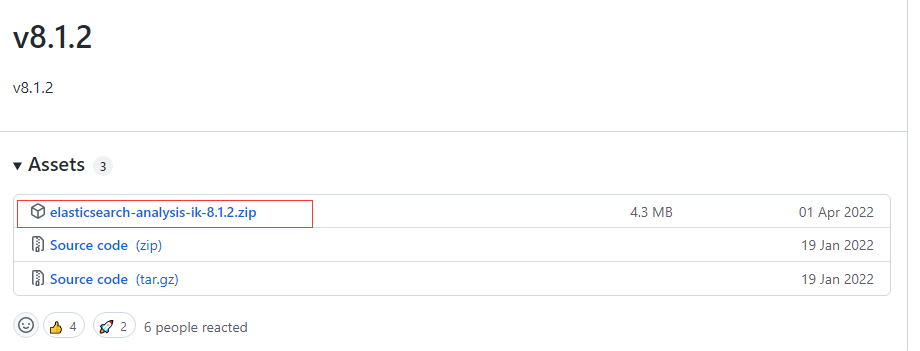

# Elasticsearch

## 安装（docker）

### 拉取

### 启动

## 安装（普通安装）

### ~~环境准备~~

安装、配置jdk (es只带jdk可不安装)

### 下载

https://www.elastic.co/cn/downloads/elasticsearch

### 解压

 `tar -xzvf elasticsearch-8.1.2-linux-x86_64.tar.gz`

### 修改配置文件

`vi config/elasticsearch.yml`

```properties
 cluster.name: my-application #集群名称
 node.name: node-1 #节点名称
 #数据和日志的存储目录
 path.data: /www/server/es/data
 path.logs: /www/server/es/logs
 #设置绑定的ip，设置为0.0.0.0以后就可以让任何计算机节点访问到了
 network.host: 0.0.0.0
 http.port: 9200 #端口
 #设置在集群中的所有节点名称，这个节点名称就是之前所修改的，当然你也可以采用默认的也行，目前是单机，放入一个节点即可
 cluster.initial_master_nodes: ["node-1"]
 12345678910
 #取消https （8.0版本以后有这个，true为启用,false禁用 ）
 xpack.security.enabled: false
```

### ~~修改jvm内存~~

`vim config/jvm.options`

```properties
 -Xms512m
 -Xmx512m
```

### 创建用户

`useradd es`
` passwd es`（备注：密码会输入两次）

### 授权

`chown -R es /mydata/elasticsearch/elasticsearch-8.1.2`

### 切换用户

`su es`

### 启动

`./bin/elasticsearch`(备注：es根目录启动)

### 访问

ip地址：端口号


##ik中文分词器

### 下载
`https://github.com/medcl/elasticsearch-analysis-ik/releases`

==备注：根据es版本选择对应的分词器版本==
