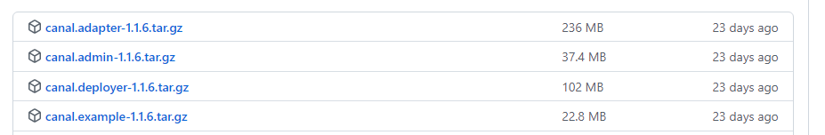

# canal  增量数据订阅与消费

## 介绍




canal.example是demo工程

canal-admin设计上是为canal提供整体配置管理、节点运维等面向运维的功能，提供相对友好的WebUI操作界面，方便更多用户快速和安全的操作

canal-adapter
增加客户端数据落地的适配及启动功能(支持HBase等)

canal-deployer
这个就相当于canal的服务端，启动它才可以在客户端接收数据库变更信息。

## 安装部署 

### 前置准备

安装jdk 版本 1.8及以上

安装mysql

#### 创建用户---授权

```sql
create user 'canal'@'%' identified by 'Canal@123456';

grant SELECT, REPLICATION SLAVE, REPLICATION CLIENT on *.* to 'canal'@'%' identified by 'Canal@123456';


备注 如果是云服务器上 canal 是一台服务器则需要再添加localhost

create user 'canal'@'localhost' identified by 'Canal@123456';
grant SELECT, REPLICATION SLAVE, REPLICATION CLIENT on *.* to 'canal'@'localhost' identified by 'Canal@123456';
```

#### 更改配置信息

① windows 配置文件位置 可以通过  ==电脑---->管理--->服务和应用程序（服务）--->mysql服务--->右键属性找到配置文件==（C:\ProgramData\MySQL\MySQL Server 5.7\my.ini）


​	②linux的mysql 配置文件在


​	③docker 中的mysql 配置文件在


```properties
[mysqld]
# 打开binlog 
log-bin=mysql-bin
# 选择ROW(行)模式 
binlog-format=ROW
# 一般存在 配置MySQL replaction需要定义，不要和canal的slaveId重复
server_id=1
```

改了配置文件之后，重启MySQL，使用命令查看是否打开binlog模式：


查看binlog日志文件列表：


查看当前正在写入的binlog文件：


### 创建用户

```
```


### 下载

 ①windows 下载

https://github.com/alibaba/canal/releases


②linux 下载

### 配置

#### mysql 相关配置

路径：canal.deployer-1.1.6\conf\example\instance.properties

```properties
#################################################
## mysql serverId , v1.0.26+ will autoGen
# canal.instance.mysql.slaveId=0

# enable gtid use true/false
canal.instance.gtidon=false

# position info
#数据库地址
canal.instance.master.address=127.0.0.1:3306
#binlog日志名称
canal.instance.master.journal.name=mysql-bin.000001
# mysql主库链接时起始的binlog偏移量
canal.instance.master.position=154
# mysql主库链接时起始的binlog的时间戳
canal.instance.master.timestamp=
canal.instance.master.gtid=

# rds oss binlog
canal.instance.rds.accesskey=
canal.instance.rds.secretkey=
canal.instance.rds.instanceId=

# table meta tsdb info
canal.instance.tsdb.enable=true
#canal.instance.tsdb.url=jdbc:mysql://127.0.0.1:3306/canal_tsdb
#canal.instance.tsdb.dbUsername=canal
#canal.instance.tsdb.dbPassword=canal

#canal.instance.standby.address =
#canal.instance.standby.journal.name =
#canal.instance.standby.position =
#canal.instance.standby.timestamp =
#canal.instance.standby.gtid=

# username/password
# 在MySQL服务器授权的账号密码
canal.instance.dbUsername=canal
canal.instance.dbPassword=Canal@123456
# 字符集
canal.instance.connectionCharset = UTF-8
# enable druid Decrypt database password
canal.instance.enableDruid=false
#canal.instance.pwdPublicKey=MFwwDQYJKoZIhvcNAQEBBQADSwAwSAJBALK4BUxdDltRRE5/zXpVEVPUgunvscYFtEip3pmLlhrWpacX7y7GCMo2/JM6LeHmiiNdH1FWgGCpUfircSwlWKUCAwEAAQ==

# table regex
# table regex .*\\..*表示监听所有表 也可以写具体的数据库名称.表名，用','隔开
#canal.instance.filter.regex=.*\\..*
canal.instance.filter.regex=z-blog.b_tag,z-blog.b_type

# table black regex
# mysql 数据解析表的黑名单，多个表用，隔开
canal.instance.filter.black.regex=mysql\\.slave_.*
# table field filter(format: schema1.tableName1:field1/field2,schema2.tableName2:field1/field2)
#canal.instance.filter.field=test1.t_product:id/subject/keywords,test2.t_company:id/name/contact/ch
# table field black filter(format: schema1.tableName1:field1/field2,schema2.tableName2:field1/field2)
#canal.instance.filter.black.field=test1.t_product:subject/product_image,test2.t_company:id/name/contact/ch

# mq config
#普通模式匹配
canal.mq.topic=example
# dynamic topic route by schema or table regex
# 按照正则表单时匹配路由
#canal.mq.dynamicTopic=mytest1.user,topic2:mytest2\\..*,.*\\..*
canal.mq.partition=0
# hash partition config
#canal.mq.enableDynamicQueuePartition=false
#canal.mq.partitionsNum=3
#canal.mq.dynamicTopicPartitionNum=test.*:4,mycanal:6
#支持字段匹配不同的Topic
#canal.mq.partitionHash=test.table:id^name,.*\\..*
#################################################
```
==备注： (可以根据实际需求选定 数据库与canal 的匹配模式 生成不同的topic)==
```
canal 1.1.3版本之后, 支持配置格式：schema 或 schema.table，多个配置之间使用逗号或分号分隔

例子1：test\\.test 指定匹配的单表，发送到以test_test为名字的topic上
例子2：.*\\..* 匹配所有表，则每个表都会发送到各自表名的topic上
例子3：test 指定匹配对应的库，一个库的所有表都会发送到库名的topic上
例子4：test\\.* 指定匹配的表达式，针对匹配的表会发送到各自表名的topic上
例子5：test,test1\\.test1，指定多个表达式，会将test库的表都发送到test的topic上，test1\\.test1的表发送到对应的test1_test1 topic上，其余的表发送到默认的canal.mq.topic值
为满足更大的灵活性，允许对匹配条件的规则指定发送的topic名字，配置格式：topicName:schema 或 topicName:schema.table

例子1: test:test\\.test 指定匹配的单表，发送到以test为名字的topic上
例子2: test:.*\\..* 匹配所有表，因为有指定topic，则每个表都会发送到test的topic下
例子3: test:test 指定匹配对应的库，一个库的所有表都会发送到test的topic下
例子4：testA:test\\.* 指定匹配的表达式，针对匹配的表会发送到testA的topic下
例子5：test0:test,test1:test1\\.test1，指定多个表达式，会将test库的表都发送到test0的topic下，test1\\.test1的表发送到对应的test1的topic下，其余的表发送到默认的canal.mq.topic值

```
```
canal 1.1.3版本之后, 支持配置格式：schema.table:pk1^pk2，多个配置之间使用逗号分隔

例子1：test\\.test:pk1^pk2 指定匹配的单表，对应的hash字段为pk1 + pk2
例子2：.*\\..*:id 正则匹配，指定所有正则匹配的表对应的hash字段为id
例子3：.*\\..*:$pk$ 正则匹配，指定所有正则匹配的表对应的hash字段为表主键(自动查找)
例子4: 匹配规则啥都不写，则默认发到0这个partition上
例子5：.*\\..* ，不指定pk信息的正则匹配，将所有正则匹配的表,对应的hash字段为表名
按表hash: 一张表的所有数据可以发到同一个分区，不同表之间会做散列 (会有热点表分区过大问题)
例子6: test\\.test:id,.\\..* , 针对test的表按照id散列,其余的表按照table散列
```

### 启动

windows启动 \bin\startup.bat

linux 启动  \bin\startup.sh


## canal  demo测试

创建springboot 项目 引入依赖

```xml
<dependency>
    <groupId>com.alibaba.otter</groupId>
    <artifactId>canal.client</artifactId>
    <version>1.1.4</version>
</dependency>
```

```java
package com.bobo.canaldemo.client;

import com.alibaba.otter.canal.client.CanalConnector;
import com.alibaba.otter.canal.client.CanalConnectors;
import com.alibaba.otter.canal.protocol.CanalEntry.Column;
import com.alibaba.otter.canal.protocol.CanalEntry.Entry;
import com.alibaba.otter.canal.protocol.CanalEntry.EntryType;
import com.alibaba.otter.canal.protocol.CanalEntry.EventType;
import com.alibaba.otter.canal.protocol.CanalEntry.RowChange;
import com.alibaba.otter.canal.protocol.CanalEntry.RowData;
import com.alibaba.otter.canal.protocol.Message;
import org.springframework.beans.factory.InitializingBean;
import org.springframework.stereotype.Component;

import java.net.InetSocketAddress;
import java.util.List;

/**
 * @author zbobo zboboyx@163.com
 * @version v1.0
 * @date 2022/7/5
 */
@Component
public class CanalClient  implements InitializingBean {


    private final static int BATCH_SIZE = 1000;

    @Override
    public void afterPropertiesSet() throws Exception {
        // 创建链接
        CanalConnector connector = CanalConnectors.newSingleConnector(new InetSocketAddress("127.0.0.1", 11111), "example", "", "");
        try {
            //打开连接
            connector.connect();
            //订阅数据库表,全部表
            connector.subscribe(".*\\..*");
            //回滚到未进行ack的地方，下次fetch的时候，可以从最后一个没有ack的地方开始拿
            connector.rollback();
            while (true) {
                // 获取指定数量的数据
                Message message = connector.getWithoutAck(BATCH_SIZE);
                //获取批量ID
                long batchId = message.getId();
                //获取批量的数量
                int size = message.getEntries().size();
                //如果没有数据
                if (batchId == -1 || size == 0) {
                    try {
                        //线程休眠2秒
                        Thread.sleep(2000);
                    } catch (InterruptedException e) {
                        e.printStackTrace();
                    }
                } else {
                    //如果有数据,处理数据
                    printEntry(message.getEntries());
                }
                //进行 batch id 的确认。确认之后，小于等于此 batchId 的 Message 都会被确认。
                connector.ack(batchId);
            }
        } catch (Exception e) {
            e.printStackTrace();
        } finally {
            connector.disconnect();
        }
    }

    /**
     * 打印canal server解析binlog获得的实体类信息
     */
    private static void printEntry(List<Entry> entrys) {
        for (Entry entry : entrys) {
            if (entry.getEntryType() == EntryType.TRANSACTIONBEGIN || entry.getEntryType() == EntryType.TRANSACTIONEND) {
                //开启/关闭事务的实体类型，跳过
                continue;
            }
            //RowChange对象，包含了一行数据变化的所有特征
            //比如isDdl 是否是ddl变更操作 sql 具体的ddl sql beforeColumns afterColumns 变更前后的数据字段等等
            RowChange rowChage;
            try {
                rowChage = RowChange.parseFrom(entry.getStoreValue());
            } catch (Exception e) {
                throw new RuntimeException("ERROR ## parser of eromanga-event has an error , data:" + entry.toString(), e);
            }
            //获取操作类型：insert/update/delete类型
            EventType eventType = rowChage.getEventType();
            //打印Header信息
            System.out.println(String.format("================》; binlog[%s:%s] , name[%s,%s] , eventType : %s",
                    entry.getHeader().getLogfileName(), entry.getHeader().getLogfileOffset(),
                    entry.getHeader().getSchemaName(), entry.getHeader().getTableName(),
                    eventType));
            //判断是否是DDL语句
            if (rowChage.getIsDdl()) {
                System.out.println("================》;isDdl: true,sql:" + rowChage.getSql());
            }
            //获取RowChange对象里的每一行数据，打印出来
            for (RowData rowData : rowChage.getRowDatasList()) {
                //如果是删除语句
                if (eventType == EventType.DELETE) {
                    printColumn(rowData.getBeforeColumnsList());
                    //如果是新增语句
                } else if (eventType == EventType.INSERT) {
                    printColumn(rowData.getAfterColumnsList());
                    //如果是更新的语句
                } else {
                    //变更前的数据
                    System.out.println("------->; before");
                    printColumn(rowData.getBeforeColumnsList());
                    //变更后的数据
                    System.out.println("------->; after");
                    printColumn(rowData.getAfterColumnsList());
                }
            }
        }
    }

    private static void printColumn(List<Column> columns) {
        for (Column column : columns) {
            System.out.println(column.getName() + " : " + column.getValue() + "    update=" + column.getUpdated());
        }
    }
}

```

### 测试

启动springboot 项目 更改数据库中的数据 如果打印对应日志即为成功 


