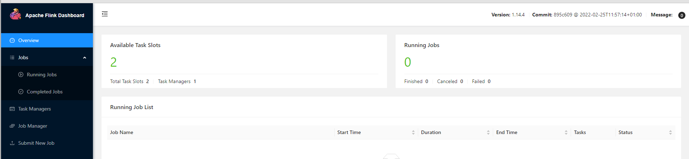

# Flink 

## 安装（docker）

```sell
# 创建文件夹
mkdir flink
## 进入文件夹 
cd /flink
## 创建文件
touch docker-compose.yml
## 添加配置文件
##---------------------------------开始------------------------------------------------
version: "2.2"
services:
  jobmanager:
    image: flink:1.14.4-scala_2.11
    ports:
      - "8081:8081"
    command: jobmanager
    environment:
      - |
        FLINK_PROPERTIES=
        jobmanager.rpc.address: jobmanager        

  taskmanager:
    image: flink:1.14.4-scala_2.11
    depends_on:
      - jobmanager
    command: taskmanager
    scale: 1
    environment:
      - |
        FLINK_PROPERTIES=
        jobmanager.rpc.address: jobmanager
        taskmanager.numberOfTaskSlots: 2        
## -------------------------------------------结束-------------------------------------

# 启动
$ docker-compose up -d
# 关闭
$ docker-compose down
```

备注：如果==-bash: docker-compose: 未找到命令== 报此错误 则安装docker-compose

```
curl -L https://get.daocloud.io/docker/compose/releases/download/1.29.2/docker-compose-`uname -s`-`uname -m` > /usr/local/bin/docker-compose

chmod +x /usr/local/bin/docker-compose
## 测试是否安装成功 显示版本号则安装成功
docker-compose version
```


访问：`localhost:8081`

