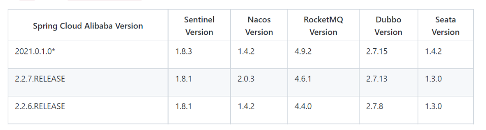

# seata 分布式事务

## 安装

官方文档：https://seata.io/zh-cn/docs/user/txgroup/transaction-group.html

### 新建seata 数据库(执行sql)

```sql
CREATE TABLE IF NOT EXISTS `global_table`
(
    `xid`                       VARCHAR(128) NOT NULL,
    `transaction_id`            BIGINT,
    `status`                    TINYINT      NOT NULL,
    `application_id`            VARCHAR(32),
    `transaction_service_group` VARCHAR(32),
    `transaction_name`          VARCHAR(128),
    `timeout`                   INT,
    `begin_time`                BIGINT,
    `application_data`          VARCHAR(2000),
    `gmt_create`                DATETIME,
    `gmt_modified`              DATETIME,
    PRIMARY KEY (`xid`),
    KEY `idx_gmt_modified_status` (`gmt_modified`, `status`),
    KEY `idx_transaction_id` (`transaction_id`)
) ENGINE = InnoDB
  DEFAULT CHARSET = utf8;

-- the table to store BranchSession data
CREATE TABLE IF NOT EXISTS `branch_table`
(
    `branch_id`         BIGINT       NOT NULL,
    `xid`               VARCHAR(128) NOT NULL,
    `transaction_id`    BIGINT,
    `resource_group_id` VARCHAR(32),
    `resource_id`       VARCHAR(256),
    `branch_type`       VARCHAR(8),
    `status`            TINYINT,
    `client_id`         VARCHAR(64),
    `application_data`  VARCHAR(2000),
    `gmt_create`        DATETIME(6),
    `gmt_modified`      DATETIME(6),
    PRIMARY KEY (`branch_id`),
    KEY `idx_xid` (`xid`)
) ENGINE = InnoDB
  DEFAULT CHARSET = utf8;

-- the table to store lock data
CREATE TABLE IF NOT EXISTS `lock_table`
(
    `row_key`        VARCHAR(128) NOT NULL,
    `xid`            VARCHAR(128),
    `transaction_id` BIGINT,
    `branch_id`      BIGINT       NOT NULL,
    `resource_id`    VARCHAR(256),
    `table_name`     VARCHAR(32),
    `pk`             VARCHAR(36),
    `gmt_create`     DATETIME,
    `gmt_modified`   DATETIME,
    PRIMARY KEY (`row_key`),
    KEY `idx_branch_id` (`branch_id`)
) ENGINE = InnoDB
  DEFAULT CHARSET = utf8;

CREATE TABLE IF NOT EXISTS `distributed_lock`
(
    `lock_key`       CHAR(20) NOT NULL,
    `lock_value`     VARCHAR(20) NOT NULL,
    `expire`         BIGINT,
    primary key (`lock_key`)
) ENGINE = InnoDB
  DEFAULT CHARSET = utf8mb4;

INSERT INTO `distributed_lock` (lock_key, lock_value, expire) VALUES ('AsyncCommitting', ' ', 0);
INSERT INTO `distributed_lock` (lock_key, lock_value, expire) VALUES ('RetryCommitting', ' ', 0);
INSERT INTO `distributed_lock` (lock_key, lock_value, expire) VALUES ('RetryRollbacking', ' ', 0);
INSERT INTO `distributed_lock` (lock_key, lock_value, expire) VALUES ('TxTimeoutCheck', ' ', 0);
```


### 编写seata shell 脚本

1、新建seata.sh

2、复制配置到seata.sh 文件中

3、根据实际情况更改配置 

4、执行seata.sh 文件

```sell
#!/bin/bash
seataPort="8091"
#实际地址
realIp="192.168.0.1"
nacosServerIp="81.68.183.233"
nacosServerPort="8848"
namespace="ead14db5-fa34-4328-b39e-09ac5e1103b1"

mysqlServerIp="192.168.2.56"
mysqlServerPort="3306"
mysqlDatabase="seata"
mysqlUsername="root"
mysqlPassword="123456"

# 运行容器
docker run -d --name seata142 -p ${seataPort}:8091 seataio/seata-server:1.4.2

mkdir -p /home/docker/seata/
docker cp seata142:/seata-server/resources  /home/docker/seata
docker stop seata142
docker rm seata142
rm -rf /home/docker/seata/resources/registry.conf

cat > /home/docker/seata/resources/registry.conf <<-EOF

registry {
  type = "nacos"
  loadBalance = "RandomLoadBalance"
  loadBalanceVirtualNodes = 10

  nacos {
    application = "seata-server"
    serverAddr = "${nacosServerIp}:${nacosServerPort}"
    group = "SEATA_GROUP"
    # 指定命名空间
    namespace = "${namespace}"
    cluster = "default"
    username = "nacos"
    password = "nacos"
  }

  file {
    name = "file.conf"
  }
}

config {
  type = "nacos"

  nacos {
    serverAddr = "${nacosServerIp}:${nacosServerPort}"
    # 指定命名空间
    namespace = "${namespace}"
    group = "SEATA_GROUP"
    username = "nacos"
    password = "nacos"
  }

  file {
    name = "file.conf"
  }
}

EOF

cat > /home/docker/seata/config.txt <<- EOF
service.vgroupMapping.my_test_tx_group=default
store.db.driverClassName=com.mysql.cj.jdbc.Driver
store.db.url=jdbc:mysql://${mysqlServerIp}:${mysqlServerPort}/${mysqlDatabase}?characterEncoding=utf8&useSSL=false&serverTimezone=UTC
store.db.user=${mysqlUsername}
store.db.password=${mysqlPassword}
EOF

cat > /home/docker/seata/nacosConfig.sh <<- "EOF"
#!/bin/bash
# Copyright 1999-2019 Seata.io Group.
#
# Licensed under the Apache License, Version 2.0 (the "License");
# you may not use this file except in compliance with the License.
# You may obtain a copy of the License at、
#
#      http://www.apache.org/licenses/LICENSE-2.0
#
# Unless required by applicable law or agreed to in writing, software
# distributed under the License is distributed on an "AS IS" BASIS,
# WITHOUT WARRANTIES OR CONDITIONS OF ANY KIND, either express or implied.
# See the License for the specific language governing permissions and
# limitations under the License.

while getopts ":h:p:g:t:u:w:" opt
do
  case $opt in
  h)
    host=$OPTARG
    ;;
  p)
    port=$OPTARG
    ;;
  g)
    group=$OPTARG
    ;;
  t)
    tenant=$OPTARG
    ;;
  u)
    username=$OPTARG
    ;;
  w)
    password=$OPTARG
    ;;
  ?)
    echo " USAGE OPTION: $0 [-h host] [-p port] [-g group] [-t tenant] [-u username] [-w password] "
    exit 1
    ;;
  esac
done

if [ -z ${host} ]; then
    host=localhost
fi
if [ -z ${port} ]; then
    port=8848
fi
if [ -z ${group} ]; then
    group="SEATA_GROUP"
fi
if [ -z ${tenant} ]; then
    tenant=""
fi
if [ -z ${username} ]; then
    username=""
fi
if [ -z ${password} ]; then
    password=""
fi

nacosAddr=$host:$port
contentType="content-type:application/json;charset=UTF-8"

echo "set nacosAddr=$nacosAddr"
echo "set group=$group"

urlencode() {
  length="${#1}"
  i=0
  while [ $length -gt $i ]; do
    char="${1:$i:1}"
    case $char in
    [a-zA-Z0-9.~_-]) printf $char ;;
    *) printf '%%%02X' "'$char" ;;
    esac
    i=`expr $i + 1`
  done
}

failCount=0
tempLog=$(mktemp -u)
function addConfig() {
  dataId=`urlencode $1`
  content=`urlencode $2`
  curl -X POST -H "${contentType}" "http://$nacosAddr/nacos/v1/cs/configs?dataId=$dataId&group=$group&content=$content&tenant=$tenant&username=$username&password=$password" >"${tempLog}" 2>/dev/null
  if [ -z $(cat "${tempLog}") ]; then
    echo " Please check the cluster status. "
    exit 1
  fi
  if [ "$(cat "${tempLog}")" == "true" ]; then
    echo "Set $1=$2 successfully "
  else
    echo "Set $1=$2 failure "
    failCount=`expr $failCount + 1`
  fi
}

count=0
for line in $(cat $(dirname "$PWD") /home/docker/seata/config.txt | sed s/[[:space:]]//g); do
    count=`expr $count + 1`
	key=${line%%=*}
    value=${line#*=}
	addConfig "${key}" "${value}"
done

echo "========================================================================="
echo " Complete initialization parameters,  total-count:$count ,  failure-count:$failCount "
echo "========================================================================="

if [ ${failCount} -eq 0 ]; then
	echo " Init nacos config finished, please start seata-server. "
else
	echo " init nacos config fail. "
fi
EOF
# 推送seata配置
sh /home/docker/seata/nacosConfig.sh -h ${nacosServerIp} -p ${nacosServerPort} -g SEATA_GROUP -u nacos -w nacos -t ${namespace}

docker run -d --name seata142 -p ${seataPort}:8091 --privileged=true --restart=always -e SEATA_CONFIG_NAME=file:/seata-server/resources/registry -e SEATA_IP=${realIp} -v /home/docker/seata/resources:/seata-server/resources seataio/seata-server:1.4.2
```

## springcloud 整合seata

### 对应版本


