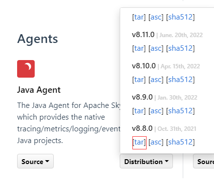
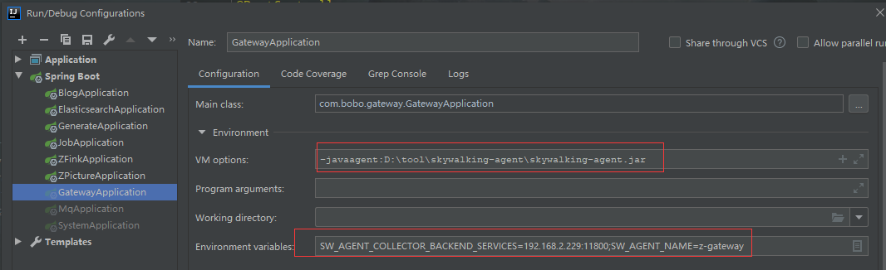

# skywalking 链路追踪

## 安装（docker）

```

# 服务端
docker run \
--name skywalking-oap \
--restart always \
-p 11800:11800 \
-p 12800:12800 -d \
--privileged=true \
-e TZ=Asia/Shanghai \
-e SW_STORAGE=elasticsearch7 \
-e SW_STORAGE_ES_CLUSTER_NODES=192.168.2.229:9200 \
-v /house/skywalking/config:/config \
apache/skywalking-oap-server:8.6.0-es7


# ui 界面
docker run \
--name skywalking-ui \
--restart always \
-p 8081:8080 -d \
--privileged=true \
--link skywalking-oap:skywalking-oap \
-e TZ=Asia/Shanghai \
-e SW_OAP_ADDRESS=192.168.2.229:12800 \
apache/skywalking-ui:8.6.0

#访问 192.168.2.229:8081
```

## 下载skywalking-agent

https://skywalking.apache.org/downloads/




备注：解压后 vm options 填入解压的jar 包路径

## idea 启动配置



```
#skywalking-agent.jar 路径
-javaagent:D:\tool\skywalking-agent\skywalking-agent.jar

#服务地址 ； 服务名称
SW_AGENT_COLLECTOR_BACKEND_SERVICES=192.168.2.229:11800;SW_AGENT_NAME=z-gateway
```

## 设置过期时间

普通： apache-skywalking-apm-bin\config\application.yml

docker ：skywalking-oap-server\config\application.yml

在 SkyWalking 中，有两种类型的可观测性数据：

1. 记录包括痕迹、日志、topN 抽样报表和告警。`recordDataTTL`适用于**记录**数据。
2. 指标包括服务、实例、端点和拓扑图的所有指标。元数据（服务、实例或端点的列表）也属于指标。`metricsDataTTL`适用于**Metrics**数据。

这些是不同类型的设置：

```yaml
    # Set a timeout on metrics data. After the timeout has expired, the metrics data will automatically be deleted.
    recordDataTTL: ${SW_CORE_RECORD_DATA_TTL:3} # Unit is day
    metricsDataTTL: ${SW_CORE_METRICS_DATA_TTL:7} # Unit is day
```


