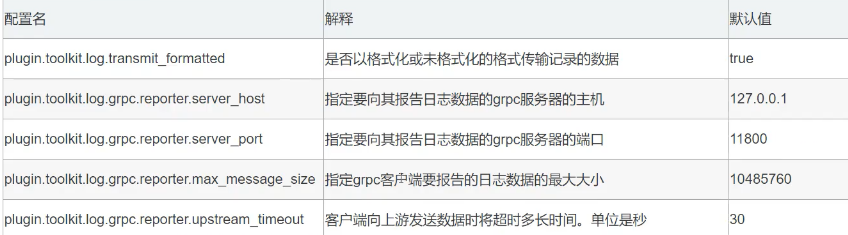

# skywalking 链路追踪

## 安装（docker）

```

# 服务端
docker run \
--name skywalking-oap \
--restart always \
-p 11800:11800 \
-p 12800:12800 -d \
--privileged=true \
-e TZ=Asia/Shanghai \
-e SW_STORAGE=elasticsearch7 \
-e SW_STORAGE_ES_CLUSTER_NODES=192.168.2.229:9200 \
-v /house/skywalking/config:/config \
apache/skywalking-oap-server:8.6.0-es7


# ui 界面
docker run \
--name skywalking-ui \
--restart always \
-p 8081:8080 -d \
--privileged=true \
--link skywalking-oap:skywalking-oap \
-e TZ=Asia/Shanghai \
-e SW_OAP_ADDRESS=192.168.2.229:12800 \
apache/skywalking-ui:8.6.0

#访问 192.168.2.229:8081
```

## 下载skywalking-agent

https://skywalking.apache.org/downloads/


备注：解压后 vm options 填入解压的jar 包路径

## idea 启动配置


```
#skywalking-agent.jar 路径
-javaagent:D:\tool\skywalking-agent\skywalking-agent.jar

#服务地址 ； 服务名称
SW_AGENT_COLLECTOR_BACKEND_SERVICES=192.168.2.229:11800;SW_AGENT_NAME=z-gateway
```

## 设置过期时间

普通： apache-skywalking-apm-bin\config\application.yml

docker ：skywalking-oap-server\config\application.yml

在 SkyWalking 中，有两种类型的可观测性数据：

1. 记录包括痕迹、日志、topN 抽样报表和告警。`recordDataTTL`适用于**记录**数据。
2. 指标包括服务、实例、端点和拓扑图的所有指标。元数据（服务、实例或端点的列表）也属于指标。`metricsDataTTL`适用于**Metrics**数据。

这些是不同类型的设置：

```yaml
    # Set a timeout on metrics data. After the timeout has expired, the metrics data will automatically be deleted.
    recordDataTTL: ${SW_CORE_RECORD_DATA_TTL:3} # Unit is day
    metricsDataTTL: ${SW_CORE_METRICS_DATA_TTL:7} # Unit is day
```

## 设置日志显示

### maven 引入

```xml
 <!-- 引入skywalking 日志依赖 -->
        <dependency>
            <groupId>org.apache.skywalking</groupId>
            <artifactId>apm-toolkit-logback-1.x</artifactId>
            <version>8.6.0</version>
        </dependency>
```

### 添加 logback-spring.xml

```xml
<?xml version="1.0" encoding="UTF-8"?>
<configuration>

    <!--  控制台日志输出的格式中添加tid  -->
    <appender name="console" class="ch.qos.logback.core.ConsoleAppender">
        <encoder class="ch.qos.logback.core.encoder.LayoutWrappingEncoder">
            <layout class="org.apache.skywalking.apm.toolkit.log.logback.v1.x.TraceIdPatternLogbackLayout">
                <pattern>%d{HH:mm:ss.SSS} [%thread] %-5level logger_name:%logger{36} - [%tid] - message:%msg%n</pattern>
            </layout>
        </encoder>
    </appender>
    <!-- skywalking grpc 日志收集 8.4.0版本开始支持 -->
    <appender name="grpc-log" class="org.apache.skywalking.apm.toolkit.log.logback.v1.x.log.GRPCLogClientAppender">
        <encoder class="ch.qos.logback.core.encoder.LayoutWrappingEncoder">
            <layout class="org.apache.skywalking.apm.toolkit.log.logback.v1.x.mdc.TraceIdMDCPatternLogbackLayout">
                <Pattern>%d{yyyy-MM-dd HH:mm:ss.SSS} [%tid] [%thread] %-5level %logger{36} -%msg%n</Pattern>
            </layout>
        </encoder>
    </appender>
    <root level="DEBUG">
        <appender-ref ref="console" />
        <appender-ref ref="grpc-log" />
    </root>
</configuration>
```

### yaml 引用 logback-spring.xml

```yaml
logging:
  config: classpath:logback-spring.xml
  level:
    com.bobo.system: debug
```

### 配置agent\config\agent.config

注意：如果SkyWalking的服务端不是部署在本地，也就是SkyWalking没有和微服务部署在同一台服务器中的话，需要修改`agent\config\agent.config`文件，在结尾添加以下配置，主要就是修改SkyWalking服务的ip和端口

```
plugin.toolkit.log.grpc.reporter.server_host=${SW_GRPC_LOG_SERVER_HOST:127.0.0.1}
plugin.toolkit.log.grpc.reporter.server_port=${SW_GRPC_LOG_SERVER_PORT:11800}
plugin.toolkit.log.grpc.reporter.max_message_size=${SW_GRPC_LOG_MAX_MESSAGE_SIZE:10485760}
plugin.toolkit.log.grpc.reporter.upstream_timeout=${SW_GRPC_LOG_GRPC_UPSTREAM_TIMEOUT:30}
```



