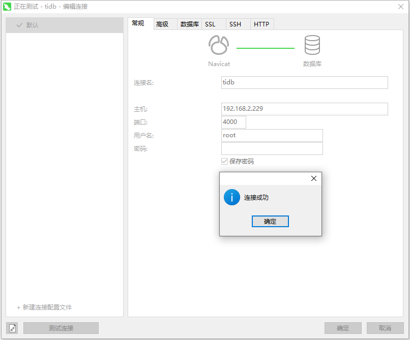

# TIdb   数据库

## 安装 （docker）

```shell
## 拉取
docker pull pingcap/tidb
## 创建文件夹
mkdir -p /data/tidb/data
## 挂载启动
docker run --name tidb -d -v /data/tidb/data:/tmp/tidb --privileged=true -p 4000:4000 -p 10080:10080 pingcap/tidb:latest

```

## 登录

备注：==tidb 数据库默认没有密码==

​		密码设置：` update user set authentication_string = password('123456') where User = 'root';`

​		权限加载：`FLUSH PRIVILEGES;`

命令登录：`mysql --host 127.0.0.1 --port 4000 -u root`

navicat登录：

